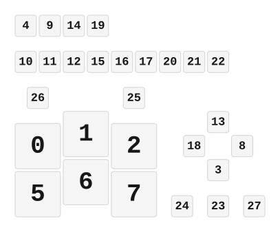

# ZMK Configuration for StudioPad

*Generated by Shield Wizard for ZMK*



Download compiled firmware from the Actions tab. <https://zmk.dev/docs/user-setup#installing-the-firmware>

Edit your keymap <https://zmk.dev/docs/keymaps>.
User keymap is located at [`config/studiopad.keymap`](config/studiopad.keymap).

-----

<details>
<summary>
Shield Wizard Debug Information
</summary>

In case of broken configuration, here is the Shield Wizard internal data used to generate this configuration:

Commit: 5840d41ac0915092c8fe45da617ffb4bb91e1b97

```json
{"name":"StudioPad","shield":"studiopad","dongle":false,"modules":[],"layout":[{"id":"01KQ011SN8R9B96TQWV6AV6TA4","part":0,"row":0,"col":0,"w":1,"h":1,"x":0,"y":2.25,"r":0,"rx":0,"ry":0},{"id":"01KQ011V0CGNWH7BS5JW9E4N59","part":0,"row":0,"col":1,"w":1,"h":1,"x":1,"y":2,"r":0,"rx":0,"ry":0},{"id":"01KQ012K77PNB4RCQSD186MPFR","part":0,"row":0,"col":2,"w":1,"h":1,"x":2,"y":2.25,"r":0,"rx":0,"ry":0},{"id":"01KQ012KFN0T2XP7W3HPQDRR9E","part":0,"row":0,"col":3,"w":0.5,"h":0.5,"x":4,"y":3,"r":0,"rx":0,"ry":0},{"id":"01KQ012PC8KYEBY0VWV2Q790J4","part":0,"row":0,"col":4,"w":0.5,"h":0.5,"x":0,"y":0,"r":0,"rx":0,"ry":0},{"id":"01KQ012XG175Z33KVWXMHARMB1","part":0,"row":1,"col":0,"w":1,"h":1,"x":0,"y":3.25,"r":0,"rx":0,"ry":0},{"id":"01KQ0134MJ4D2N8G7DWTHH606R","part":0,"row":1,"col":1,"w":1,"h":1,"x":1,"y":3,"r":0,"rx":0,"ry":0},{"id":"01KQ01352XZ299BB34V2ZPBHDW","part":0,"row":1,"col":2,"w":1,"h":1,"x":2,"y":3.25,"r":0,"rx":0,"ry":0},{"id":"01KQ0135AVGEZJQB918CC7C5NX","part":0,"row":1,"col":3,"w":0.5,"h":0.5,"x":4.5,"y":2.5,"r":0,"rx":0,"ry":0},{"id":"01KQ0135JSS2J9HC3D1MTW2QKA","part":0,"row":1,"col":4,"w":0.5,"h":0.5,"x":0.5,"y":0,"r":0,"rx":0,"ry":0},{"id":"01KQ01479EG115WMMWPF3NT15G","part":0,"row":2,"col":0,"w":0.5,"h":0.5,"x":0,"y":0.75,"r":0,"rx":0,"ry":0},{"id":"01KQ014F7Z09RVW6E8AH98NDVN","part":0,"row":2,"col":1,"w":0.5,"h":0.5,"x":0.5,"y":0.75,"r":0,"rx":0,"ry":0},{"id":"01KQ014FDBZDPXG9H516RG277Y","part":0,"row":2,"col":2,"w":0.5,"h":0.5,"x":1,"y":0.75,"r":0,"rx":0,"ry":0},{"id":"01KQ014FJ1109Z13964W6A9QMT","part":0,"row":2,"col":3,"w":0.5,"h":0.5,"x":4,"y":2,"r":0,"rx":0,"ry":0},{"id":"01KQ014FQ6CJ5R638H9QJ9D7P1","part":0,"row":2,"col":4,"w":0.5,"h":0.5,"x":1,"y":0,"r":0,"rx":0,"ry":0},{"id":"01KQ014G9F1XMD7GF9JB3W2TSZ","part":0,"row":3,"col":0,"w":0.5,"h":0.5,"x":1.5,"y":0.75,"r":0,"rx":0,"ry":0},{"id":"01KQ014T6JW89JRW45ZER5V2DD","part":0,"row":3,"col":1,"w":0.5,"h":0.5,"x":2,"y":0.75,"r":0,"rx":0,"ry":0},{"id":"01KQ014TB9NZ5W80CY7JCF3DAB","part":0,"row":3,"col":2,"w":0.5,"h":0.5,"x":2.5,"y":0.75,"r":0,"rx":0,"ry":0},{"id":"01KQ014TGXM0CVKXTJ1Z3ANPV4","part":0,"row":3,"col":3,"w":0.5,"h":0.5,"x":3.5,"y":2.5,"r":0,"rx":0,"ry":0},{"id":"01KQ014TRE5BGF3BNJ913JJ04S","part":0,"row":3,"col":4,"w":0.5,"h":0.5,"x":1.5,"y":0,"r":0,"rx":0,"ry":0},{"id":"01KQ014WTG1V5X0368XR56ZN2T","part":0,"row":4,"col":0,"w":0.5,"h":0.5,"x":3,"y":0.75,"r":0,"rx":0,"ry":0},{"id":"01KQ0151WY800RZN5S0AW7JF45","part":0,"row":4,"col":1,"w":0.5,"h":0.5,"x":3.5,"y":0.75,"r":0,"rx":0,"ry":0},{"id":"01KQ015223QNGTSNEFF1TMM9K9","part":0,"row":4,"col":2,"w":0.5,"h":0.5,"x":4,"y":0.75,"r":0,"rx":0,"ry":0},{"id":"01KQ0152779727PSEYJ5B2JBDB","part":0,"row":4,"col":3,"w":0.5,"h":0.5,"x":4,"y":3.75,"r":0,"rx":0,"ry":0},{"id":"01KQ0152SHYKGMG4F8Z611T1KD","part":0,"row":5,"col":0,"w":0.5,"h":0.5,"x":3.25,"y":3.75,"r":0,"rx":0,"ry":0},{"id":"01KQ015ANYVP9YAVKYY4YPHG4X","part":0,"row":5,"col":1,"w":0.5,"h":0.5,"x":2.25,"y":1.5,"r":0,"rx":0,"ry":0},{"id":"01KQ015AVKQ5M92GVRQ2HFFHRQ","part":0,"row":5,"col":2,"w":0.5,"h":0.5,"x":0.25,"y":1.5,"r":0,"rx":0,"ry":0},{"id":"01KQ015B1908FMG0RPWA5DMPKV","part":0,"row":5,"col":3,"w":0.5,"h":0.5,"x":4.75,"y":3.75,"r":0,"rx":0,"ry":0}],"parts":[{"name":"unibody","controller":"xiao_ble_plus","wiring":"matrix_diode","pins":{"d2":"input","d3":"input","d4":"input","d5":"input","d6":"input","d7":"input","d11":"output","d12":"output","d13":"output","d14":"output","d15":"output","d0":"encoder","d1":"encoder","d8":"encoder","d9":"encoder"},"keys":{"01KQ011SN8R9B96TQWV6AV6TA4":{"input":"d2","output":"d11"},"01KQ011V0CGNWH7BS5JW9E4N59":{"input":"d2","output":"d12"},"01KQ012K77PNB4RCQSD186MPFR":{"input":"d2","output":"d13"},"01KQ012KFN0T2XP7W3HPQDRR9E":{"input":"d2","output":"d14"},"01KQ012PC8KYEBY0VWV2Q790J4":{"input":"d2","output":"d15"},"01KQ012XG175Z33KVWXMHARMB1":{"input":"d3","output":"d11"},"01KQ0134MJ4D2N8G7DWTHH606R":{"input":"d3","output":"d12"},"01KQ01352XZ299BB34V2ZPBHDW":{"input":"d3","output":"d13"},"01KQ0135AVGEZJQB918CC7C5NX":{"input":"d3","output":"d14"},"01KQ0135JSS2J9HC3D1MTW2QKA":{"input":"d3","output":"d15"},"01KQ01479EG115WMMWPF3NT15G":{"input":"d4","output":"d11"},"01KQ014F7Z09RVW6E8AH98NDVN":{"input":"d4","output":"d12"},"01KQ014FDBZDPXG9H516RG277Y":{"input":"d4","output":"d13"},"01KQ014FJ1109Z13964W6A9QMT":{"input":"d4","output":"d14"},"01KQ014FQ6CJ5R638H9QJ9D7P1":{"input":"d4","output":"d15"},"01KQ014G9F1XMD7GF9JB3W2TSZ":{"input":"d5","output":"d11"},"01KQ014T6JW89JRW45ZER5V2DD":{"input":"d5","output":"d12"},"01KQ014TB9NZ5W80CY7JCF3DAB":{"input":"d5","output":"d13"},"01KQ014TGXM0CVKXTJ1Z3ANPV4":{"input":"d5","output":"d14"},"01KQ014TRE5BGF3BNJ913JJ04S":{"input":"d5","output":"d15"},"01KQ014WTG1V5X0368XR56ZN2T":{"input":"d6","output":"d11"},"01KQ0151WY800RZN5S0AW7JF45":{"input":"d6","output":"d12"},"01KQ015223QNGTSNEFF1TMM9K9":{"input":"d6","output":"d13"},"01KQ0152779727PSEYJ5B2JBDB":{"input":"d6","output":"d14"},"01KQ0152SHYKGMG4F8Z611T1KD":{"input":"d7","output":"d11"},"01KQ015ANYVP9YAVKYY4YPHG4X":{"input":"d7","output":"d12"},"01KQ015AVKQ5M92GVRQ2HFFHRQ":{"input":"d7","output":"d13"},"01KQ015B1908FMG0RPWA5DMPKV":{"input":"d7","output":"d14"}},"encoders":[{"pinA":"d0","pinB":"d1"},{"pinA":"d8","pinB":"d9"}],"buses":[{"name":"spi0","devices":[],"type":"spi"},{"name":"spi1","devices":[],"type":"spi"},{"name":"spi2","devices":[],"type":"spi"},{"name":"spi3","devices":[],"type":"spi"},{"name":"i2c0","devices":[],"type":"i2c"},{"name":"i2c1","devices":[],"type":"i2c"}]}]}
```

</details>
